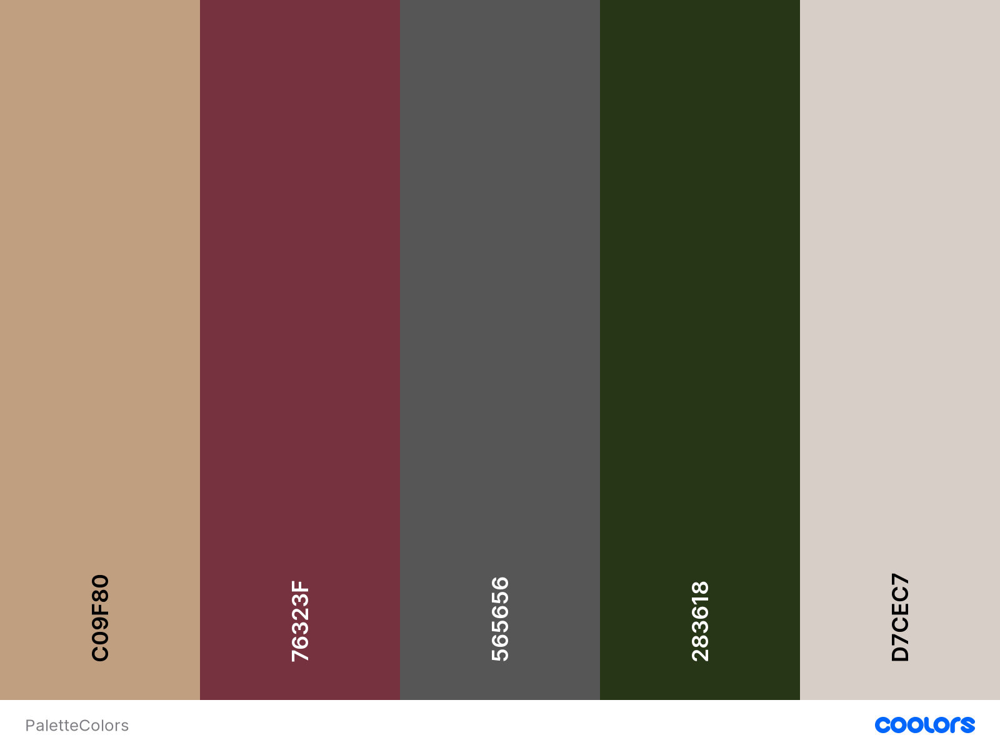
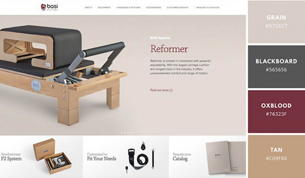

## Template y Documentacion
[Template&Documentation](https://gitlab.com/muebleriavasquez_web/mubleriavasquez_template_web)

## Fonts

```html
<!--
Google Font
=========================== -->
<link href="https://fonts.googleapis.com/css?family=Open+Sans:300i,300,400i,400,700" rel="stylesheet">
<link href="https://fonts.googleapis.com/css?family=Poppins:400,500,600,700" rel="stylesheet"> 
<link href="https://fonts.googleapis.com/css?family=Roboto:400,500i,700" rel="stylesheet"> 
```
## Colors

```css
    /* CSS */
--camel: hsla(29, 33%, 75%, 1);
--catawba: hsla(349, 58%, 46%, 1);
--davys-grey: hsla(0, 0%, 34%, 1);
--kombu-green: hsla(88, 56%, 21%, 1);
--pale-silver: hsla(26, 7%, 84%, 1);

/* SCSS HEX */
$camel: #c09f80ff;
$catawba: #76323fff;
$davys-grey: #565656ff;
$kombu-green: #283618ff;
$pale-silver: #d7cec7ff;

/* SCSS HSL */
$camel: hsla(29, 33%, 75%, 1);
$catawba: hsla(349, 58%, 46%, 1);
$davys-grey: hsla(0, 0%, 34%, 1);
$kombu-green: hsla(88, 56%, 21%, 1);
$pale-silver: hsla(26, 7%, 84%, 1);

/* SCSS RGB */
$camel: rgba(192, 159, 128, 1);
$catawba: rgba(118, 50, 63, 1);
$davys-grey: rgba(86, 86, 86, 1);
$kombu-green: rgba(40, 54, 24, 1);
$pale-silver: rgba(215, 206, 199, 1);

/* SCSS Gradient */
$gradient-top: linear-gradient(0deg, #c09f80ff, #76323fff, #565656ff, #283618ff, #d7cec7ff);
$gradient-right: linear-gradient(90deg, #c09f80ff, #76323fff, #565656ff, #283618ff, #d7cec7ff);
$gradient-bottom: linear-gradient(180deg, #c09f80ff, #76323fff, #565656ff, #283618ff, #d7cec7ff);
$gradient-left: linear-gradient(270deg, #c09f80ff, #76323fff, #565656ff, #283618ff, #d7cec7ff);
$gradient-top-right: linear-gradient(45deg, #c09f80ff, #76323fff, #565656ff, #283618ff, #d7cec7ff);
$gradient-bottom-right: linear-gradient(135deg, #c09f80ff, #76323fff, #565656ff, #283618ff, #d7cec7ff);
$gradient-top-left: linear-gradient(225deg, #c09f80ff, #76323fff, #565656ff, #283618ff, #d7cec7ff);
$gradient-bottom-left: linear-gradient(315deg, #c09f80ff, #76323fff, #565656ff, #283618ff, #d7cec7ff);
$gradient-radial: radial-gradient(#c09f80ff, #76323fff, #565656ff, #283618ff, #d7cec7ff);

```



## Template Structure
```html
<header class="header_area">
 
</header>
 
<main class="site-main">
    <section class="section">
 
    </section>
    <section class="section">
 
    </section>
    <section class="section">
 
    </section>
</main>
 
<footer class="footer">
 
</footer>

```

## CSS Files and Structure
```html
<!--
CSS
============================================= -->
<link rel="stylesheet" href="css/bootstrap.min.css">
<link rel="stylesheet" href="css/animate.css">
<link rel="stylesheet" href="css/owl.carousel.min.css">
<link rel="stylesheet" href="css/all.css">
<link rel="stylesheet" href="css/flaticon.css">
<link rel="stylesheet" href="css/themify-icons.css">
<link rel="stylesheet" href="css/magnific-popup.css">
<link rel="stylesheet" href="css/slick.css">
<link rel="stylesheet" href="css/style.css">

```

## Javascript Files and Structure
```html
<!--
JavaScripts
========================== -->
<script src="js/jquery-1.12.1.min.js"></script>
<script src="js/popper.min.js"></script>
<script src="js/bootstrap.min.js"></script>
<script src="js/jquery.magnific-popup.js"></script>
<script src="js/swiper.min.js"></script>
<script src="js/masonry.pkgd.js"></script>
<script src="js/owl.carousel.min.js"></script>
<script src="js/jquery.nice-select.min.js"></script>
<script src="js/slick.min.js"></script>
<script src="js/jquery.counterup.min.js"></script>
<script src="js/waypoints.min.js"></script>
<script src="js/contact.js"></script>
<script src="js/jquery.ajaxchimp.min.js"></script>
<script src="js/jquery.form.js"></script>
<script src="js/jquery.validate.min.js"></script>
<script src="js/mail-script.js"></script>
<script src="js/custom.js"></script>
```